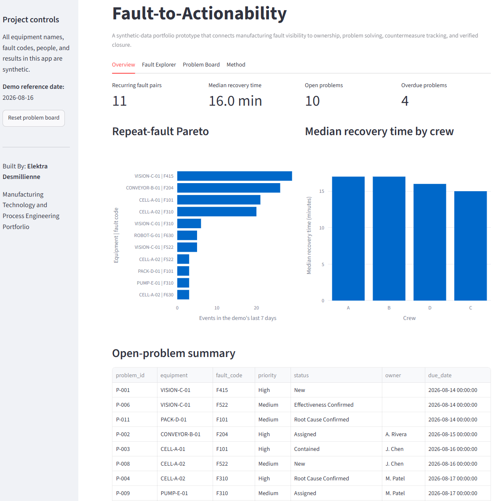
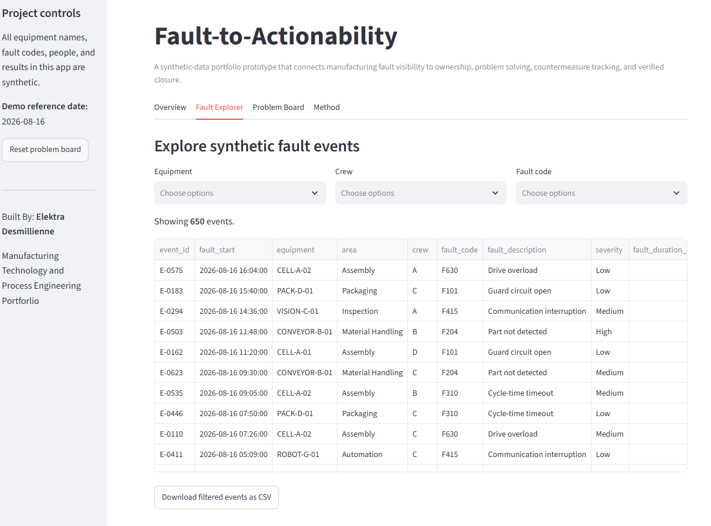
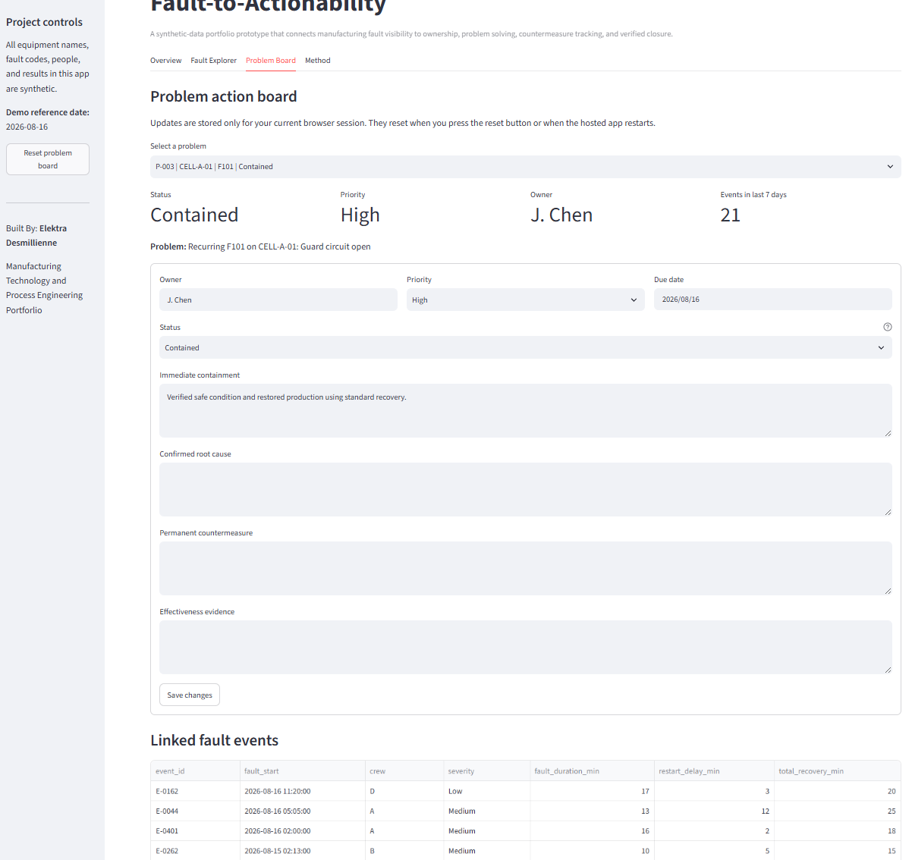
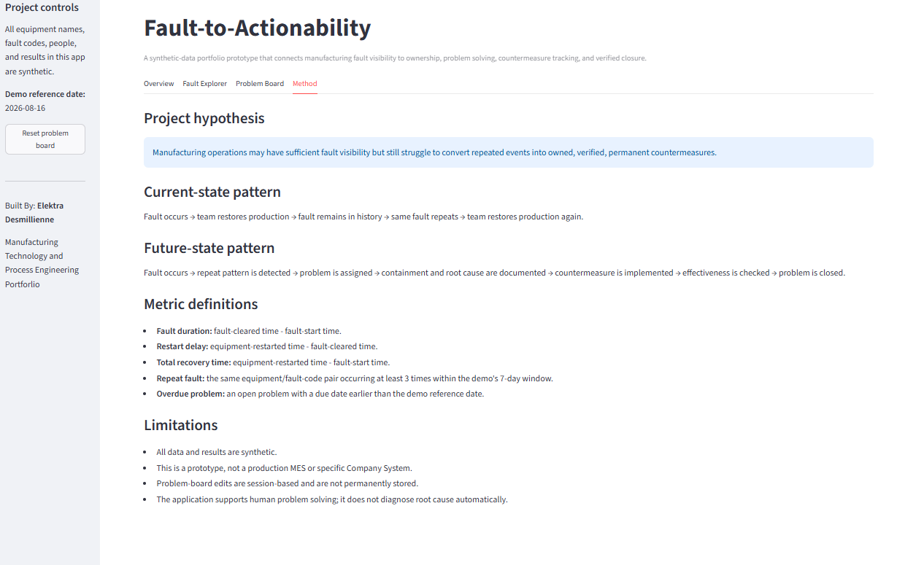

# Fault-to-Actionability

A beginner-friendly Streamlit portfolio project that connects manufacturing fault visibility to repeat-fault detection, ownership, problem-solving actions, countermeasure tracking, and effectiveness confirmation.

## Live application
Add your Streamlit URL here after deployment.

## Application Preview
### Overview


### Fault Explorer


### Problem Board


### Method


## Business problem
Manufacturing operations can have extensive fault data but still struggle to convert repeated events into owned and verified permanent countermeasures.

## Project hypothesis
A structured workflow that connects fault events to accountability and closure can improve actionability even when visibility already exists.

## Features
- 650 synthetic fault events across multiple equipment assets and four crews
- Repeat-fault Pareto
- Fault duration, restart delay, and total recovery time
- Fault explorer with filters and CSV download
- Session-based problem action board
- Defined problem-solving workflow
- Closure validation requiring effectiveness evidence
- Business requirements, user stories, UAT tests, and architecture documentation

## Technology
- Python
- Streamlit
- pandas
- NumPy
- Plotly
- Git and GitHub

## Run locally

1. Create and activate a virtual environment.
2. Install dependencies:

```bash
python -m pip install -r requirements.txt
```

3. Regenerate the synthetic data if needed:

```bash
python scripts/generate_demo_data.py
```

4. Start the app:

```bash
python -m streamlit run streamlit_app.py
```

## Repository structure

```text
fault-to-actionability/
├── streamlit_app.py
├── requirements.txt
├── DATA_NOTICE.md
├── scripts/
│   └── generate_demo_data.py
├── data/
│   ├── fault_events.csv
│   └── problem_records.csv
├── docs/
│   ├── project_charter.md
│   ├── requirements.md
│   ├── user_stories.md
│   ├── uat_test_cases.md
│   ├── architecture.md
│   └── portfolio_copy.md
└── assets/
```

## Important limitation
Problem-board updates are stored only in the current Streamlit browser session. They are not written permanently to a cloud database.

## Data and confidentiality
All data, equipment names, fault codes, people, and results are synthetic. See `DATA_NOTICE.md`.
