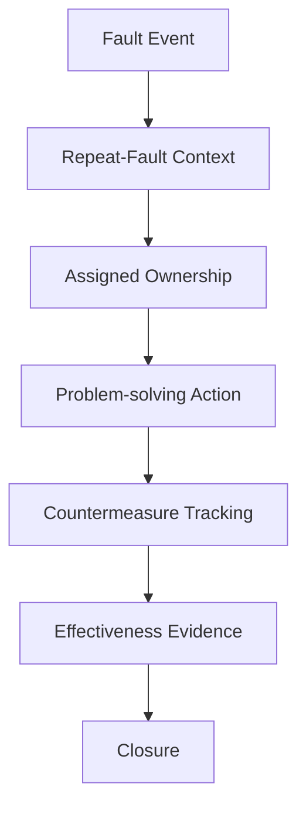

# Fault-to-Actionability

**Status**: Developing Prototype
**Focus**: Visibility to Actionability
**Data**: Fully Synthetic

An exploratory Streamlit prototype examining a narrower question within the broader research project:
>**What makes visible information actionable on the shop floor?**

This project focuses specifically on manufcturing faults:

>Once a fault is visible, what additional structure may be needed to connect it to repeatability detection, ownership, problem-solving actions, countermeasure follow through, and evidence of effectiveness?

Fault-to-Actionability provides one possible workflow for exploring that question. It is a portfolio research artifact and technical protoype, not a validated production system.

## Live application
Streamlit URL here

## Problem being explored
Manufacturing operations fault data can make events, duration, and recurrence visible. Visibility alone however, doe not define:
* Who owns the response
* What action is expected
* How problem-solving activity should be documented
* How countermeasures should be followed
* What evidence is neededbefore a problem is considered closed

This prototype explores how those elements might remain connected within one workflow



## Working hypothesis
A structured workflow that keeps fault events connected to ownership, problem solving actions, countermeasures, and effectiveness evidence may make visible fault information more actionable.

## Features
- 650 synthetic fault events across multiple equipment assets and four crews
- Repeat-fault Pareto
- Fault duration, restart delay, and total recovery time
- Fault explorer with filters and CSV download
- Session-based problem action board
- Defined problem-solving workflow
- Closure validation requiring effectiveness evidence
- Business requirements, user stories, UAT tests, and architecture documentation

## What the prototype is designed to explore
The prototype allows a user to examine how a fault might move through several stages:
1.    Identify repeated or operationally significant fault patterns.
2.    Review relevant fault and recovery-time context.
3.    Select a fault for structured follow-up.
4.    Assign ownership and document the problem being addressed.
5.    Record actions and proposed countermeasures.
6.    Track progress toward closure.
7.    Document evidence intended to support an effectiveness review.
These stages represent the current design of the prototype. They should not be interpreted as a validated model for the entire shop floor actionability research.

## Application Preview
### Overview


### Fault Explorer


### Problem Board


### Method


## Technology
- Python
- Streamlit
- pandas
- NumPy
- Plotly
- Git and GitHub

## Run locally

1. Create and activate a virtual environment.
2. Install dependencies:

```bash
python -m pip install -r requirements.txt
```

3. Regenerate the synthetic data if needed:

```bash
python scripts/generate_demo_data.py
```

4. Start the app:

```bash
python -m streamlit run streamlit_app.py
```

## Repository structure

```text
fault-to-actionability/
├── streamlit_app.py
├── requirements.txt
├── DATA_NOTICE.md
├── scripts/
│   └── generate_demo_data.py
├── data/
│   ├── fault_events.csv
│   └── problem_records.csv
├── docs/
│   ├── project_charter.md
│   ├── requirements.md
│   ├── user_stories.md
│   ├── uat_test_cases.md
│   ├── architecture.md
└── assets/
```

## Current limitations
This prototype has several important limitations:
* All fault events, assets, crews, fault codes, people, and results are synthetic.
* Problem-board updates are stored only within the current Streamlit browser session.
* Updates are not written permanently to a local or cloud database.
* An effectiveness-evidence entry documents what a user considers evidence; it does not independently verify that a countermeasure was effective.
* The prototype demonstrates workflow logic, not an improvement in manufacturing performance.
* The project does not yet evaluate adoption, decision rights, trust, workload, organizational behavior, or integration with existing manufacturing systems.

## Data and confidentiality
All data, equipment names, fault codes, people, and results are synthetic. See `DATA_NOTICE.md`.

## Project charter
The project charter documents the problem being explored, working hypothesis, intended users, scope, core metrics, and definition of done for this prototype.
It is intended to make the design assumptions and boundaries of the project explicit rather than treating the application itself as the complete research artifact.
See `docs/project_charter.md` for the full charter.

## Feedback being sought
This project is still developing. Practitioner and researcher feedback would be especially useful on the following questions:
* Where does the path from fault visibility to owned action most often break down?
* What context is needed before a repeated fault can be treated as a problem rather than another event?
* Who should have the authority to assign, advance, or close a fault-related problem?
* What evidence is credible enough to support an effectiveness review?
* Which parts of this workflow should remain human led rather than automated?

Feedback from this prototype will be used to refine the broader research question about what makes visible shop-floor information actionable.