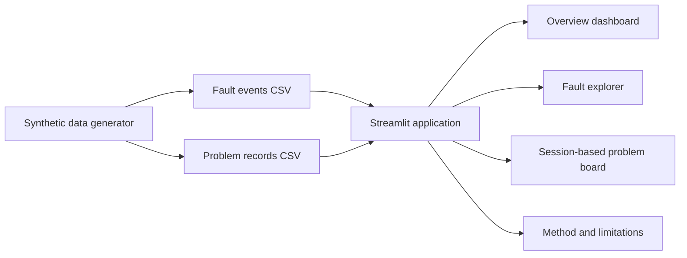

# Architecture

## Design decisions
- CSV files keep the starter version transparent and easy to inspect.
- Streamlit session state allows a user to demonstrate updates without requiring a cloud database.
- Updates are intentionally temporary; persistence can be added later using a hosted database.
- The app uses a fixed synthetic demo period so the analysis remains coherent after deployment.
